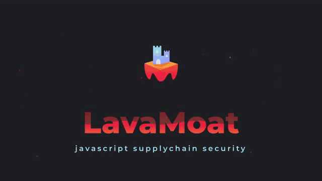

# LavaMoat explainer video

An animated explainer video for [LavaMoat](https://github.com/LavaMoat/LavaMoat) —
javascript supplychain security — generated entirely with code.

**[▶ Click the preview to watch the full video](./lavamoat-explainer.mp4)** (3:46, 1080p, narrated)

- **[`lavamoat-explainer.mp4`](./lavamoat-explainer.mp4)** — the rendered video
- **[`video/`](./video)** — the [Remotion](https://remotion.dev) project
  (scenes, narration script, render pipeline). See its README for how to
  render or tweak it, including higher-quality / 4K renders.

The narrative follows the
[Devcon 6 talk "The Attacker is Inside"](https://github.com/kumavis/talk-lavamoat-devcon6-2022).
