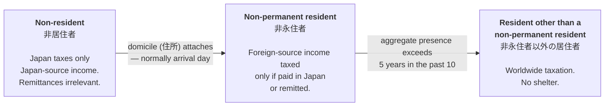

# Overview: a US citizen moving to Japan

```
As of:        2026-07-28
Read this first. Everything here is expanded, with citations, in docs 01-09.
```

## The shape of the problem

A US citizen moving to Japan ends up filing in **both** countries, permanently.
The US taxes citizens on worldwide income wherever they live, and Japan taxes
residents. Nothing removes either. The whole exercise is about **controlling the
overlap** — which country taxes what, in which order, and whether the US foreign
tax credit actually absorbs the Japanese tax or merely appears to.

Two things make this tractable:

1. Japan gives new foreign residents a **temporary concession** — the remittance
   basis — that can shelter foreign capital gains for up to five years.
2. The US **foreign tax credit** relieves most double taxation on salary.

And two things make it harder than it looks:

1. The Japanese concession has a **securities acquisition-date test** most
   summaries omit, which shelters a pre-arrival portfolio and nothing else.
2. The US credit works **badly on capital gains** and not at all against the 3.8%
   net investment income tax — so sheltering a gain from Japan does not shelter it
   from the US.

## The three phases

Use the statutory terms. The informal ones ("temporary resident") are not Japanese
tax concepts.



| | Non-resident | Non-permanent resident | Resident other than NPR |
|---|---|---|---|
| Japanese | 非居住者 | 非永住者 | 非永住者以外の居住者 |
| Starts | — | Domicile attaches (usually arrival day) | Aggregate presence exceeds 5 of past 10 years |
| Foreign salary | Untaxed | Taxed if paid in Japan or remitted | Taxed |
| Salary for work **in Japan** | Taxed | **Taxed — never shelterable** | Taxed |
| Pre-arrival securities gains | Untaxed | **Taxed only if remitted** | Taxed |
| Post-arrival securities gains | Untaxed | **Taxed regardless** | Taxed |

**Two clocks run independently, and they count different things:**

- The **five-year income tax clock** counts days of presence and ignores visa
  category entirely (doc 01).
- The **exit tax clock** counts only time on a status-based visa and ignores
  ordinary work visas entirely (doc 04).

A work-visa holder is therefore fully worldwide-taxable after five years, yet
**never** exposed to the exit tax. Conflating the two clocks is the most common
error in this area.

## The two-country filing picture

| | Japan | US |
|---|---|---|
| Tax year | Calendar | Calendar |
| Return due | 15 March | 15 April, automatic extension to 15 June when abroad |
| Basis | Residence | Citizenship |
| Salary rate | Progressive to ~55% combined | To 37%, relieved by credit |
| Listed securities gains | **20.315% flat** | 0/15/20% + 3.8% NIIT |

Japan's earlier deadline is convenient: the Japanese liability is normally known
before the US return is due, which supports the accrual election for the credit
(doc 06 §6).

## The five findings that matter most

1. **Residency starts on arrival, not after 183 days or a year.** Domicile (住所)
   attaches immediately for someone arriving on a job requiring a year or more.
   183 days plays no part in Japanese domestic law. — doc 01
2. **The remittance rule is a deeming rule, not a tracing rule.** You cannot
   designate which money you sent; any remittance is deemed to carry that year's
   foreign-source income, capped by it, with Japan-source income absorbed first.
   So the operating rule is: keep annual remittances at or below your Japan-source
   income paid abroad. — doc 02
3. **Only securities acquired *before* the non-permanent resident period are
   sheltered.** Anything bought after arrival is taxed on an arising basis whether
   remitted or not, and a forced FIFO consumes the pre-arrival lots first. — doc 02
4. **The Japanese shelter saves Japanese tax, not US tax.** IRC §865(g)(2) sources
   a gain abroad only if ≥10% foreign tax is actually paid — so a gain sheltered
   from Japan stays US-source and fully US-taxable. Anyone modelling unremitted
   gains as untaxed is wrong by the entire US liability. — doc 05
5. **Time on a work visa never counts toward the exit tax.** Immigration Appended
   Table 1 periods are excluded, so an ordinary work-visa holder is never exposed
   — but taking immigration Permanent Residence starts the clock. — doc 04

## Reading path

**Start here** → this document.

**If you want the core rule:** doc 02 (remittance basis) then doc 01 (residency).
Those two contain most of the value.

**If you want the answer to "what should I do":** doc 09 (strategy levers),
which tests both of the user's hypotheses against the law and specifies the
calculator's inputs.

**If you are implementing the calculator:** doc 03 (Japanese rate tables),
doc 06 §4 (the FTC algorithm), and doc 09 §5 (the input model).

| Doc | Subject |
|---|---|
| [01](01-japan-residency-status.md) | Residency classification, the three phases, when each starts |
| [02](02-japan-remittance-basis.md) | **The remittance basis — the central rule** |
| [03](03-japan-income-categories-and-rates.md) | Japanese income categories and rate tables |
| [04](04-japan-exit-tax-and-leaving.md) | Exit tax, departure timing, getting money out |
| [05](05-us-taxation-and-sourcing.md) | US taxation of citizens abroad, and sourcing |
| [06](06-us-foreign-tax-credit.md) | How the foreign tax credit is calculated |
| [07](07-us-japan-tax-treaty.md) | The treaty, the saving clause, and re-sourcing |
| [08](08-severing-us-state-domicile.md) | Leaving US state domicile *(least researched)* |
| [09](09-strategy-levers.md) | **Strategy levers and calculator specification** |

## How confident is this?

Every document separates **settled law** (read from archived statute or treaty
text) from **likely but unverified** and **open questions**. That split is not
decoration — the calculator's trustworthiness depends on it.

The **legal architecture** is on firm ground: residency definitions, the remittance
rule and its Cabinet Order machinery, the securities acquisition-date test, the
exit tax visa exclusion, §865 sourcing, §904 mechanics, and the treaty's saving
clause and relief article are all quoted verbatim from primary sources archived
here.

The **numbers are weaker**. Japanese inhabitant tax rules are not verified against
the Local Tax Act, the §904(b)(2)(B) capital gain adjustment is not transcribed,
and the 2013 Protocol has not been read against the 2003 Convention. These are
listed as open questions in the relevant documents and should be closed before the
calculator's output is relied on.

**This is research, not tax advice.** Get a preparer qualified in both systems.
